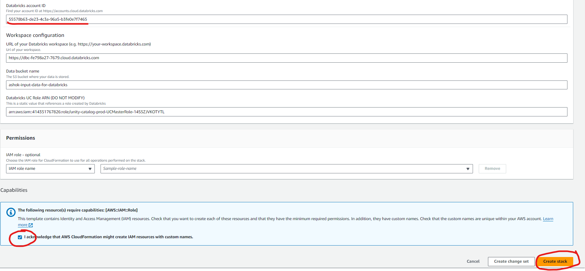

# DATA INGESTION FROM S3 IN DATABRICKS

### Login to Workspace

### Select `Data Ingestion` under `Data Engineering` section on Workspace Home page

### Select `Amazon S3` under Native integrations from the list of data sources under `Data Ingestion` section

### Click on `+` symbol to add an external connection to Amazon S3

### Select `AWS Quickstart (Recommended)` for creating a new external location and click on Next

### Provide the existing Amazon S3 Bucket Name under `Bucket Name` and `Click on Generate New Token`

In this case `ashok-input-data-for-databricks` is used for an example.

### Copy the generated Personal Access Token and click on `Launch in Quickstart`

Note: After clicking on Launch in Quickstart, it will navigate to the Create Stack section of AWS CloudFormation 

### Paste the Personal Access Token in `Databricks Personal Access Token` text under `Databricks Account Credentials`

### Confirm the `Databricks account ID` under `Databricks Account Credentials`, then `acknowledge` and click on `Create Stack`

### Wait until the CloudFormation Stack is successful

Note: Once the CloudFormation Stack is successfully created, we will be able to access AWS S3 bucket from Databricks workspace.

### Now the AWS S3 Bucket is added to the external locations of Amazon S3 list under `Data Ingestion` section

### Select the external location binding to the Amazon S3 Bucket and then we will be to see all the objects exists in the Bucket. 

### Access the file / objects exists in the Amazon S3 bucket in Databricks Notebooks like follows

