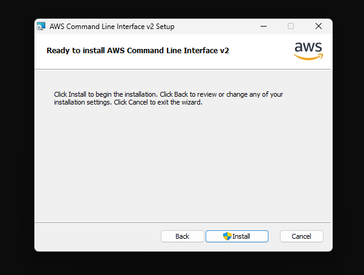

# AWS CLI Setup

## Windows

### Install Python3

### Install Pip3

### Install AWS CLI

```
msiexec.exe /i https://awscli.amazonaws.com/AWSCLIV2.msi
```





### Validating AWS CLI

```
aws
```

```
aws --version
```

