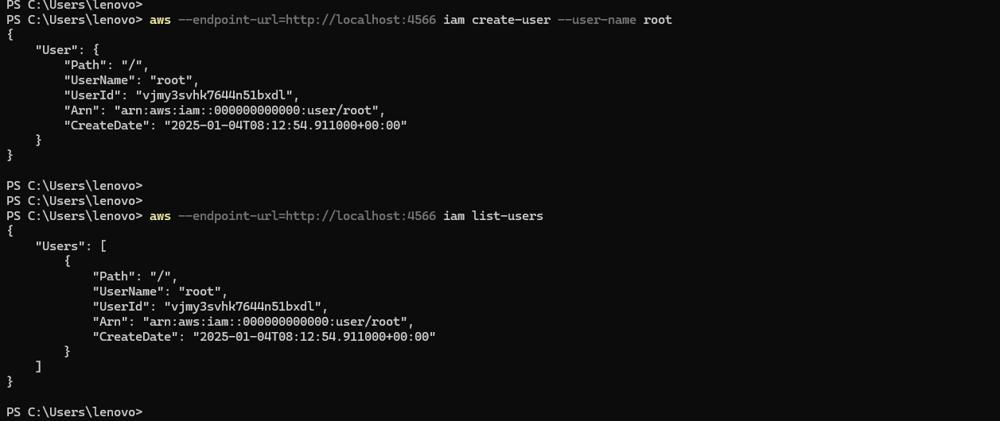

# AWS CLI Commands - Localstack

### IAM

#### User

---
##### List Users

```
aws --endpoint-url=http://localhost:4566 iam list-users
```


##### Create ROOT User

```
aws --endpoint-url=http://localhost:4566 iam create-user --user-name root
```

```
aws --endpoint-url=http://localhost:4566 iam list-users
```



##### Create ROOT Users ACCESS & SECRET Keys

```
aws --endpoint-url=http://localhost:4566 iam create-access-key --user root
```


##### Configuring AWS CLI

```
aws configure --profile local
```


##### Create DEV User

```
aws --endpoint-url=http://localhost:4566 iam create-user --user-name devuser
```

```
aws --endpoint-url=http://localhost:4566 iam list-users
```


##### Create DEV User ACCESS & SECRET Keys

```
aws --endpoint-url=http://localhost:4566 iam create-access-key --user devuser
```


##### Configuring AWS CLI for DEV User

```
aws configure --profile dev-local
```


#### Groups

---

#### List Groups

```
aws --endpoint-url=http://localhost:4566 iam list-groups
```


#### Create Group

```
aws --endpoint-url=http://localhost:4566 iam create-group --group-name developers
```

```
aws --endpoint-url=http://localhost:4566 iam create-group --group-name tester
```

```
aws --endpoint-url=http://localhost:4566 iam list-groups
```


#### Add User to the Group

Adding to Group `developers`

```
aws --endpoint-url=http://localhost:4566 iam add-user-to-group --group-name developers --user-name devuser
```

Adding to Group `tester`

```
aws --endpoint-url=http://localhost:4566 iam add-user-to-group --group-name tester --user-name devuser
```

Listing all groups of a User

```
aws --endpoint-url=http://localhost:4566 iam list-groups-for-user --user-name devuser
```


```
aws --endpoint-url=http://localhost:4566 iam get-group --group-name developers
```

```
aws --endpoint-url=http://localhost:4566 iam get-group --group-name tester
```


#### Update User's Group

```
aws --endpoint-url=http://localhost:4566 iam update-group --group-name tester --new-group-name testers
```

```
aws --endpoint-url=http://localhost:4566 iam get-group --group-name testers
```


