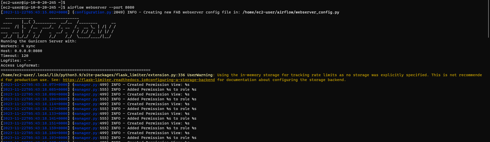

# Setting up Apache Airflow on Amazon EC2 - Amazon Linux 2023

#### Login to EC2 Instance

```
ssh -i "AshokWindows.pem" ec2-user@ec2-3-93-49-17.compute-1.amazonaws.com
```


#### Update OS Packages

```
sudo yum update -y
```


#### Install Python 3

```
sudo yum install python3 -y
```


#### Install Pip

```
sudo yum install python-pip -y
```


#### Check Python & Pip versions

```
python3 --version

pip --version
```


#### Install Apache Airflow

```
pip install apache-airflow
```


#### Install Apache Airflow Databricks Provider libraries

```
pip install apache-airflow-providers-databricks
```


#### Initialise Airflow DB

```
airflow db init
```


#### Create Airflow Admin User

```
airflow users create --username admin --firstname ashok --lastname kumar  --role Admin --email ashok@test.com
```


#### Start Airflow Webserver

```
airflow webserver --port 8080
```




#### Start Airflow Scheduler

```
airflow scheduler
```


#### Checking the status

```
ps -a
```


#### Allow inbound traffic for port 8080


#### Login to Airflow Web UI

http://ec2-3-93-49-17.compute-1.amazonaws.com:8080


