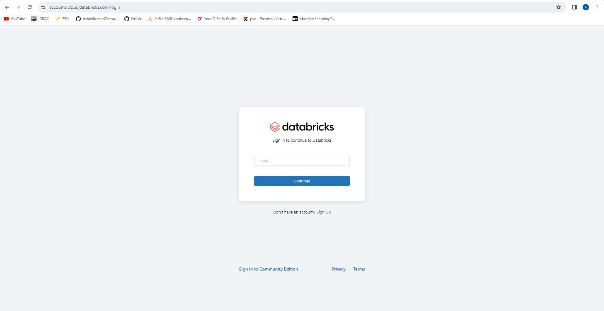
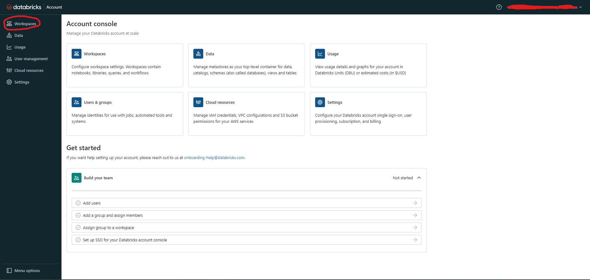
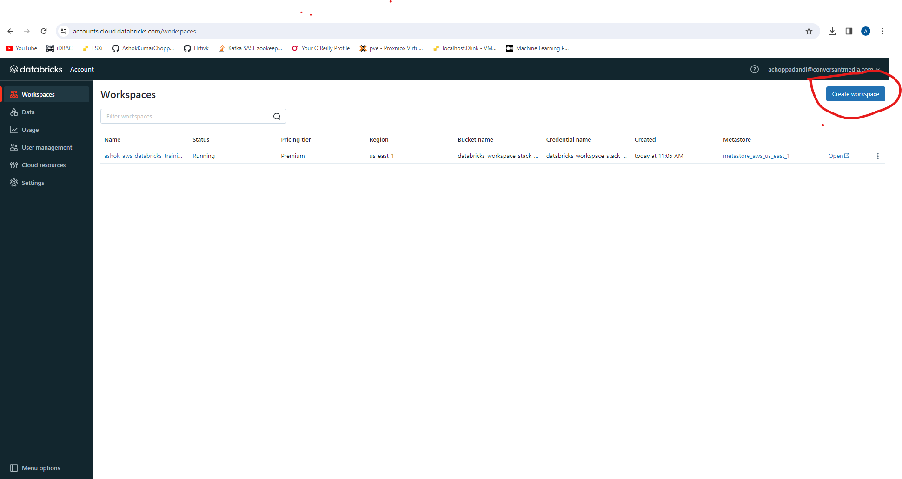
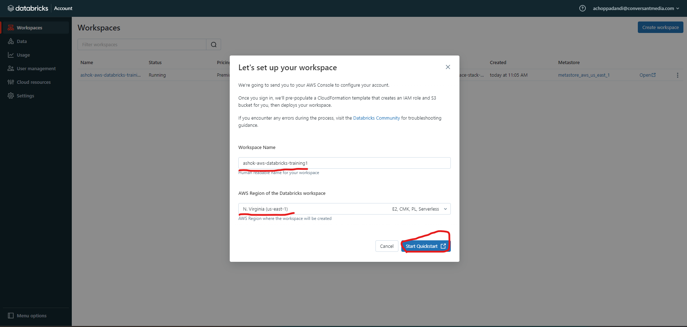
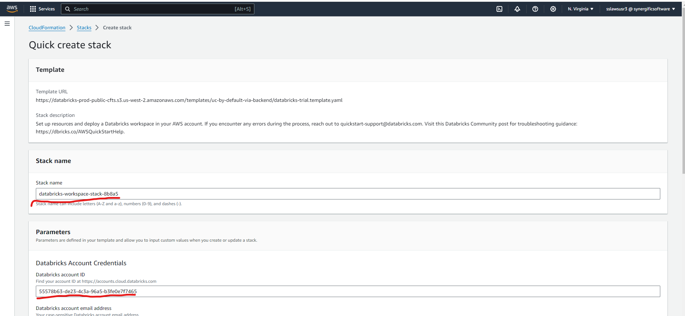
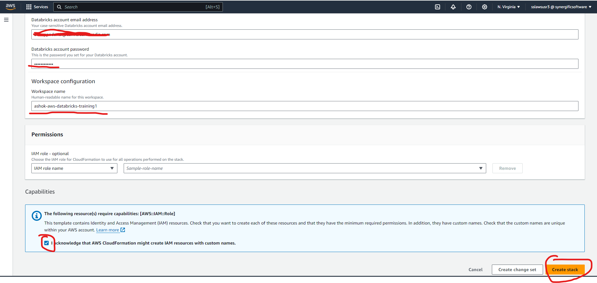
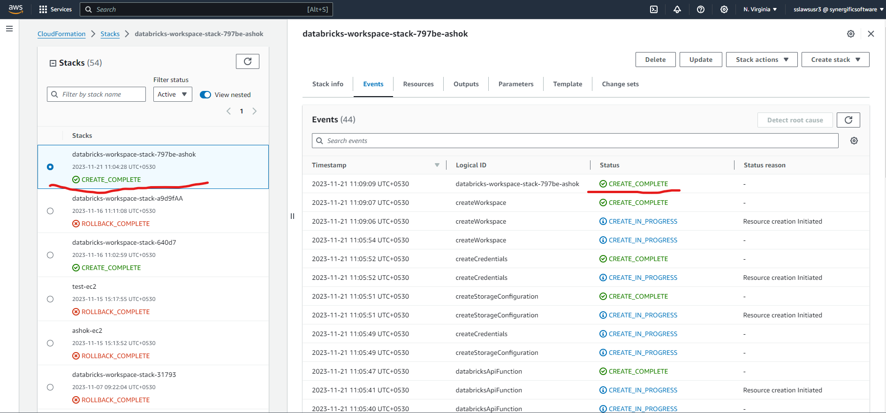
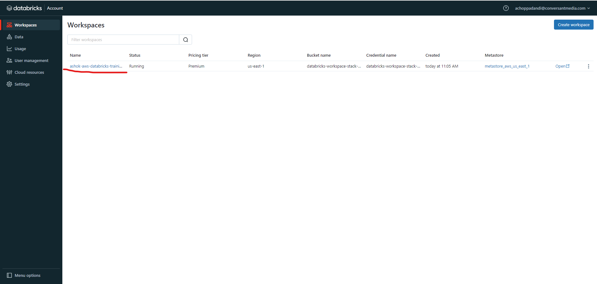
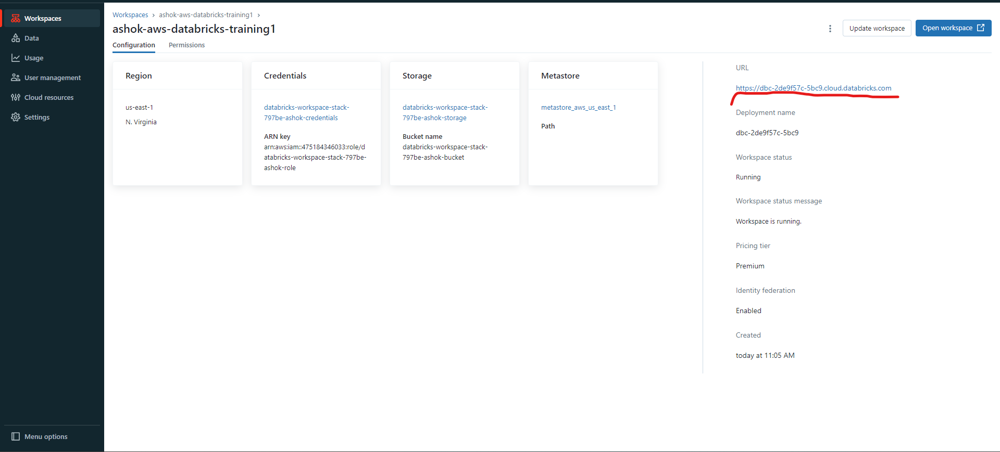
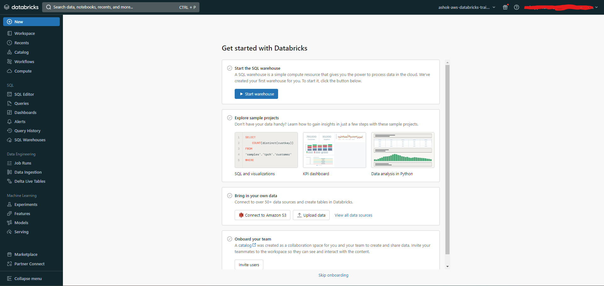

# Create Databricks Workspace

### Login to Databricks

https://accounts.cloud.databricks.com/login

### Goto the `Workspaces` under `Menu Options` in Databricks Home Page

### Click on `Create Workspace` options to create a new workspace

### Provide the `Workspace Name` and select the `AWS Region of the Databricks workspace` then click on `Start Quickstart`

Note: After clicking `Start Quickstart` this will navigate to the `Create Stack` section in AWS CloudFormation.

### Verify the `Stack name` and `Databricks account ID` in `Databricks Account Credentials` section  

### Provide the `Databricks account email address` and `Databricks account password` in `Databricks Account Credentials` section and `acknowledge` then click on `Create Stack`

### Wait for the AWS CloudFormation stack to complete

Note: After CloudFormation stack successfully completes, the workspace will be added to the list of workspaces in Databricks.

### List of Workspaces in Databricks

Click on the workspace name to navigate the workspace details

### Workspace Details

Click on the URL to login to the Databricks Workspace

### Login to Databricks Workspace 

### Workspace Home Page

