# Databricks and Spark to process data in Relational Databases

The following setup is required to process the data from relational databases (Ex: `MySQL`)

* SQL Warehouse
* External Connection
* Create Catalog
* SQL Editor

#### Login to Databricks Workspace

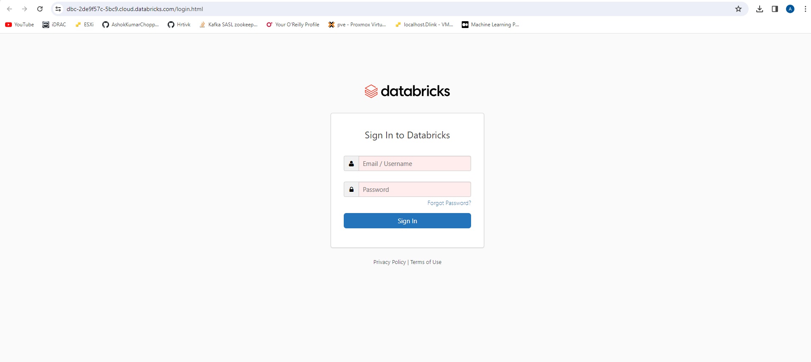

## SQL Warehouse

#### Goto `SQL Warehouses` under `SQL` from the workspace home page and click on `Create SQL Warehouse`

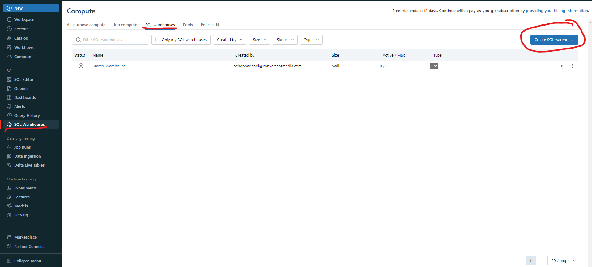

#### Provide the details for the `New SQL warehouse` and click on `Create`

The available options are:

* Name - (Ex: `ashok-sql-warehouse`)
* Cluster Size - (Ex: `2X-Small`)
* Auto stop - (Ex: `Enable`) After (Ex: `45`) minutes of inactivity
* Scaling Min. - (Ex: `1`) and Max. - (Ex: `1`)
* Type (Ex: `Pro`)

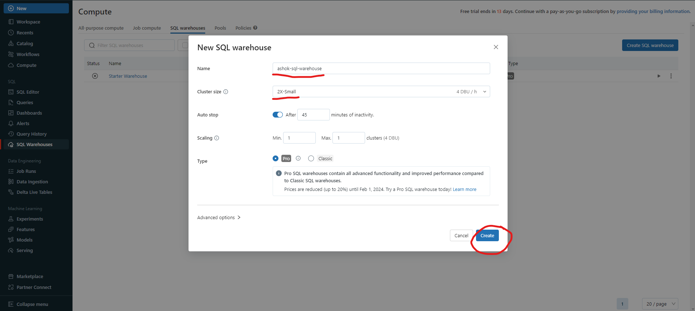

#### `Manage permissions` for the newly created SQL Warehouse and close the pop-up

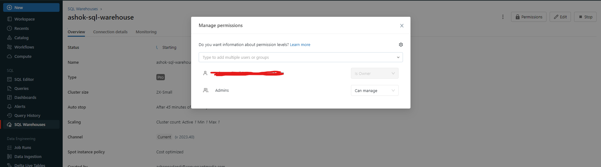

#### Wait for the cluster to be active and ready

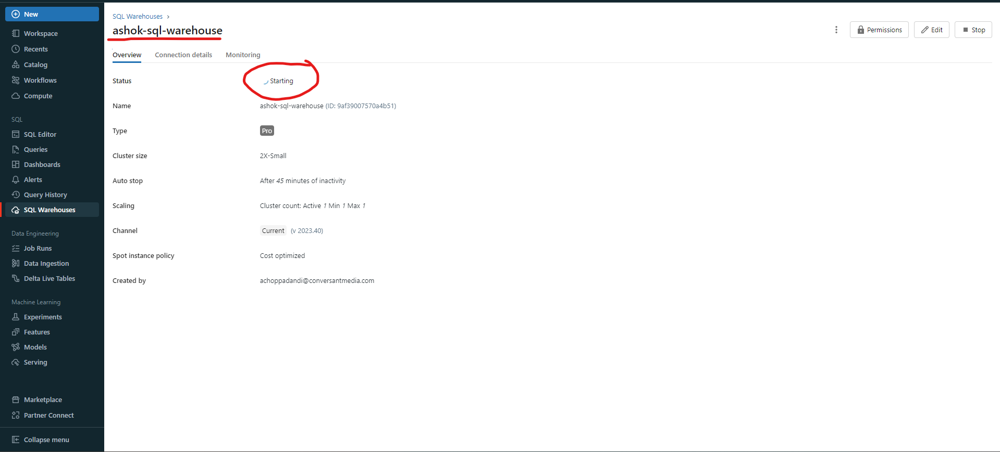

## External Connection

To create an external connection with an RDBMS (Ex: `MySQL`) follow the below steps:

#### Goto `Catalog` section from the workspace home page

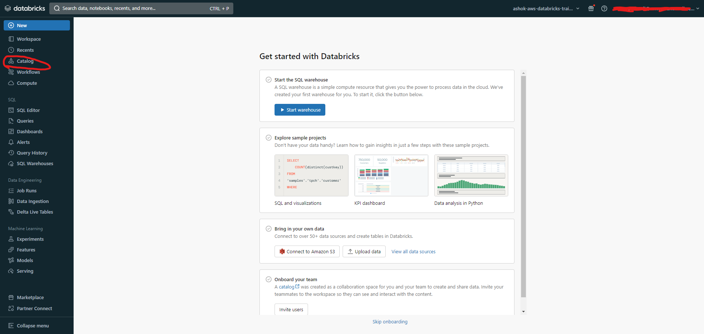

#### Under `Catalog` click on the `External Data` in the `Catalog Explorer`

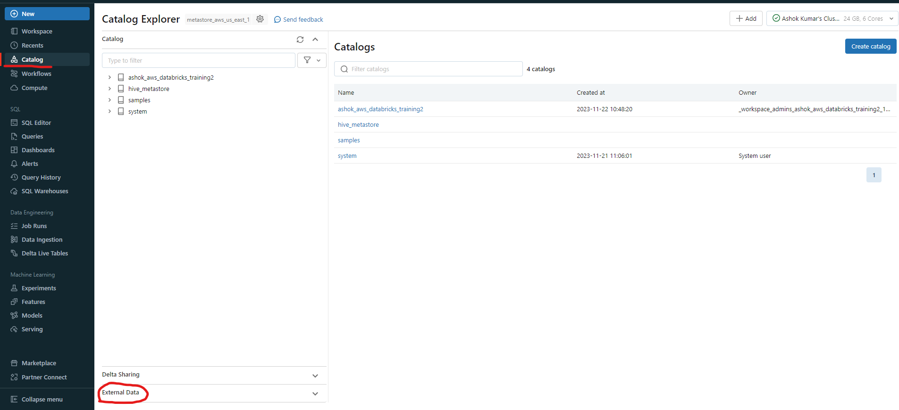

#### Select `Connections` under `External Data` and click on `Create Connection`

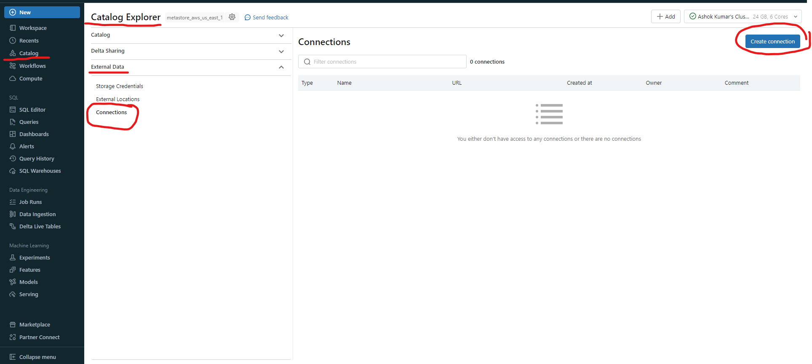

#### Configure parameters to `Create a new connection`

The following configuration parameters are available to configure:

* Connection name - (Ex: `ashok-mysql`)
* Connection type - (Ex: `MySQL`)
* User - (Ex: `root`)
* Password
* Host - (Ex: `ec2-54-227-71-93.compute-1.amazonaws.com`)
* Port - (Ex: `3306`)

After providing all the configuration parameters, `Test connection` and click on `Create`

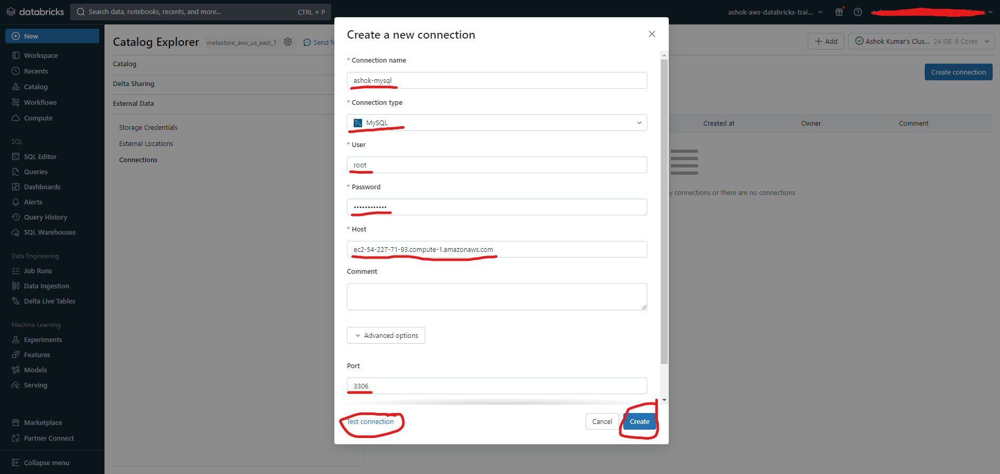

#### View Connection Details under `External Data` & `Connections` in the `Catalog` section

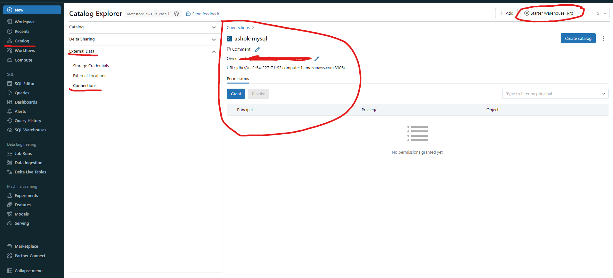

## Create Catalog

#### Goto `Catalog` option in the `Catalog Explorer`

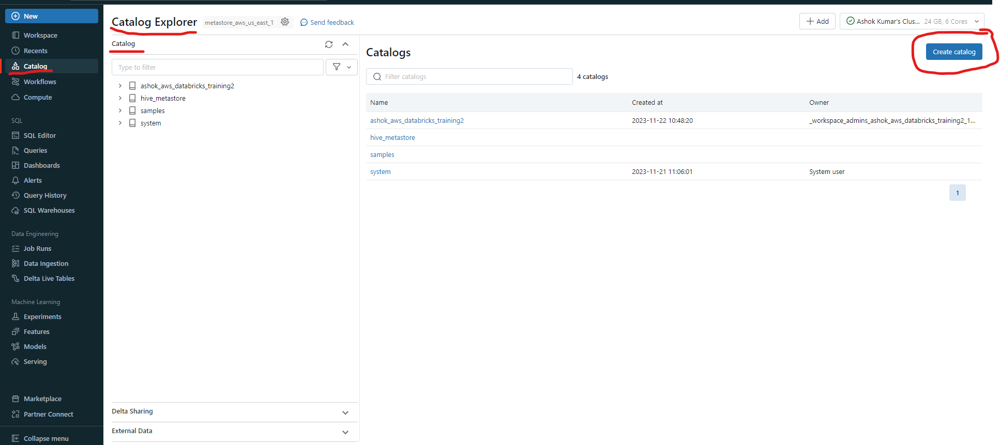

#### Select the connection details to `Create a new catalog` and click on `Create`

Provide the following details:

* Catalog name - (Ex: `ashok-mysql-catalog`)
* Type - (Ex: `Foreign`)
* Connection - (Ex: `ashok-mysql` - External connection created in the previous step)

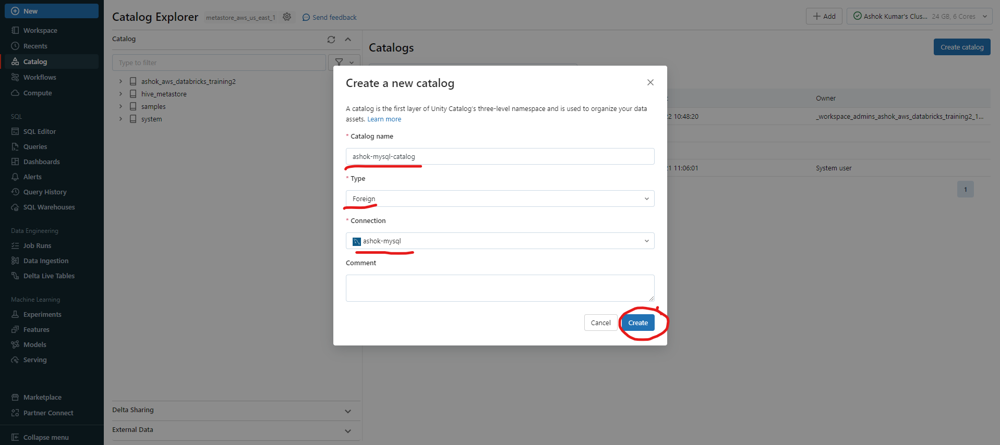

#### View the catalog details

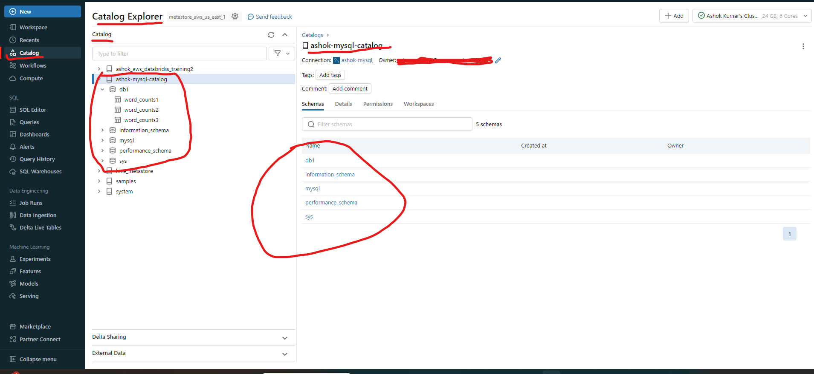

## Click on `SQL Editor` under `SQL` section to start executing the Queries on external RDBMS (Ex: `MySQL`)

Before executing the Queries, make sure the options are properly selected:

* Correct catalog - (Ex: `ashok-mysql-catalog`)
* Correct database - (Ex: `db1`)
* Correct SQL Warehouse - (Ex: `ashok-sql-warehouse`)
* Status of the SQL Warehouse - (Ex: `Active`)

Once everything is ready write the queries and execute by clicking on `Run (1000)` button

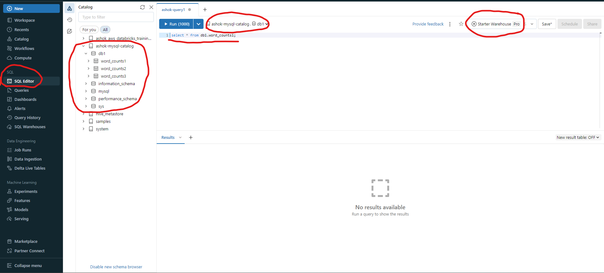