# Databricks CLI Commands

#### Install Databricks CLI on Linux

[Click Here](https://github.com/AshokKumarChoppadandi/cloud-examples/blob/main/AWS/Docs/InstallDatabricksCLI.md)

## Databricks CLI Configuration

The following are the different ways of configuring the Databricks CLI:

#### ***DEFAULT Profile Configuration***:

```
databricks configure
```

Note: This will set the `DEFAULT` profile in `~/.databrickscfg` file in the user's **HOME** directory

This will prompt for the following Databricks Workspace details:

* HOST URL - (Ex: `https://dbc-xxxxxxxx-xxxx.cloud.databricks.com`)
* Username - (Ex: `ashok@testemail.com`)
* Password - `This should be the Personal Access Token`

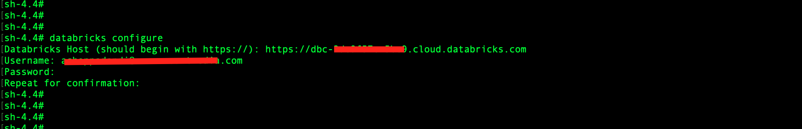

#### ***Custom Profile Configuration***:

* With Profile Name

  ```
  databricks configure --profile DEV
  ```
  
  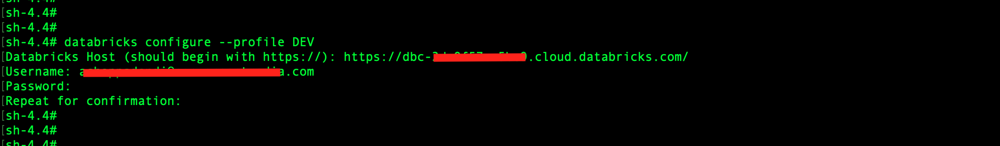

* With Profile Name and Host:
  
  ```
  databricks configure --host https://dbc-xxxxxxxx-xxxx.cloud.databricks.com --profile QA
  ```
  
  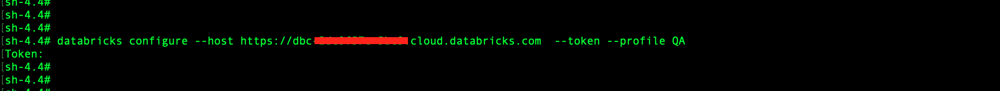

* With Profile, Host and Personal Access Token (From File)
  * Add Personal Access Token to a File
    
    ```
    cat > databricks-token.txt
    ```

    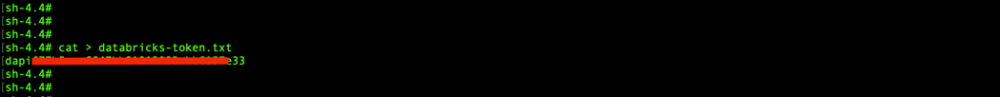
    
    ```
    databricks configure --host https://dbc-xxxxxxxx-xxxx.cloud.databricks.com  --token-file /databricks-token.txt --profile PROD
    ```

    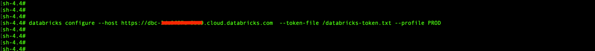

#### List profiles

```
cat ~/.databrickscfg
```

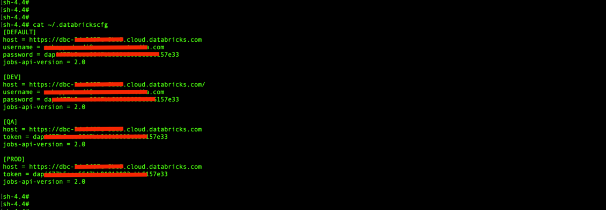

#### Executing commands 

* With `DEFAULT` Profile
  
  ```
  databricks clusters list
  ```

  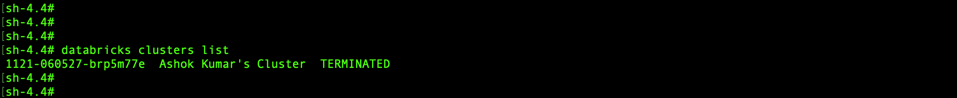

* With Custom Profile (Ex: `PROD`)

  ```
  databricks clusters list --profile PROD
  ```
  
  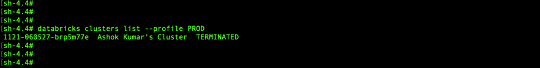

## Databricks CLI Commands

To know all the available Databricks CLI commands - [Click Here](https://docs.databricks.com/en/dev-tools/cli/commands.html)

### Examples

```
databricks -h
```

```
databricks clusters -h
```

```
databricks clusters get --cluster-id 1234-567890-brp5m77e
```

### Personal Access Tokens

#### Create a new Personal Access Token (`DEFAULT` Profile)

```
databricks tokens create --lifetime-seconds 7776000 --comment databricks-token-created-from-cli --profile DEFAULT --debug
```

**Note: 777600 Seconds = 90 Days**

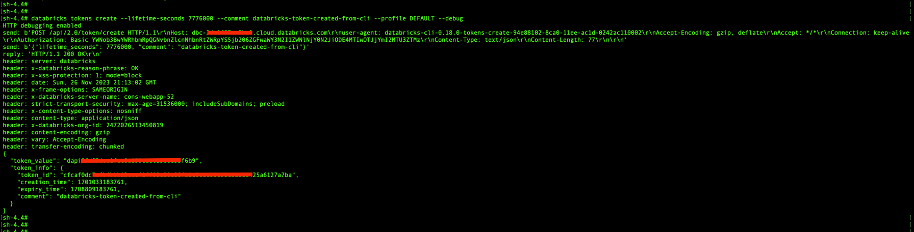

#### List Personal Access Tokens

```
databricks tokens list --profile DEFAULT
```

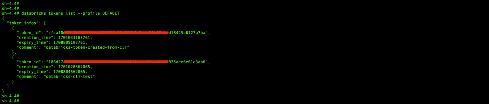

#### To Revoke a Personal Access Token

```
databricks tokens revoke --token-id cfcaf0dc7afb4bbb12ccaf1ff05a20cxxxxxxxxxxxxxxxxxxxxx8425a6127a7ba --profile DEFAULT --debug
```

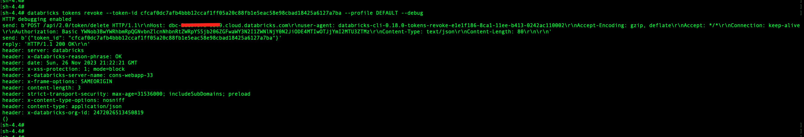

### Workspace

#### List files / directories

Syntax:

```
databricks workspace list [Path]
```

Example: 

```
databricks workspace list /
```

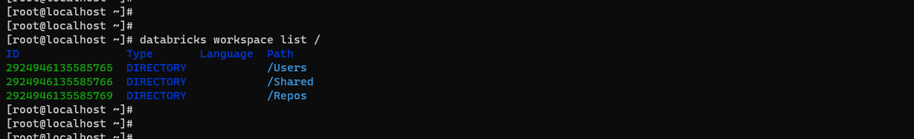

#### Export / get the files from workspace

Syntax:

```
databricks workspace export <WORKSPACE_SOURCE_PATH_FILE> --file <LOCAL_FILE_NAME> --output <OUTPUT_FORMAT>
```

Example:

```
databricks workspace export /Users/ashok@testemail.com/ETL-Pipeline1/1ExtractEmployeesDataFromS3 --file 1ExtractEmployeesDataFromS3.html --format HTML
```

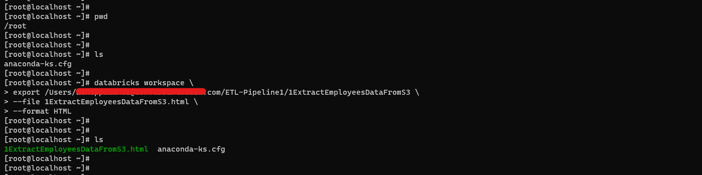

#### Export / get the directory from workspace

Syntax:

```
databricks workspace export-dir <WORKSPACE_SOURCE_PATH_FILE> --file <LOCAL_FILE_NAME> --output <OUTPUT_FORMAT>
```

Example:

```
databricks workspace export /Users/ashok@testemail.com/ETL-Pipeline1/1ExtractEmployeesDataFromS3 --file 1ExtractEmployeesDataFromS3.html --format HTML
```


#### Import / put files into the workspace

```
databricks workspace export_dir <WORKSPACE_SOURCE_PATH_DIRECTORY> <LOCAL_TARGET_PATH_FOR_DIRECTORY>
```

```
databricks workspace import /Users/achoppadandi@conversantmedia.com/Notebooks/FirstNotebook --file Example1Notebook --format SOURCE --language SCALA
```


```
databricks workspace import <LOCAL_SOURCE_PATH_FILE> <TARGET_FILE_PATH_ON_WORKSPACE>
```

```
databricks workspace import_dir <LOCAL_SOURCE_PATH_DIRECTORY> <TARGET_DIRECTORY_PATH_ON_WORKSPACE>
```

```
databricks workspace mkdirs <CREATE_NEW_DIRECTORY_IN_THE_GIVEN_PATH>
```

```
databricks workspace rm <WORKSPACE_PATH>

OR

databricks workspace delete <WORKSPACE_PATH>
```
