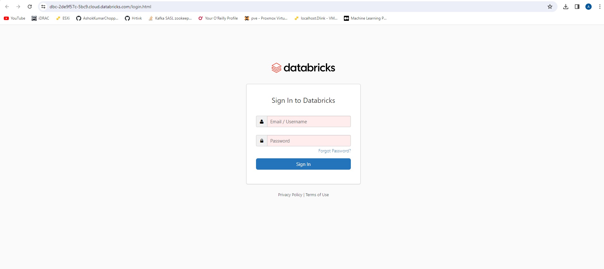
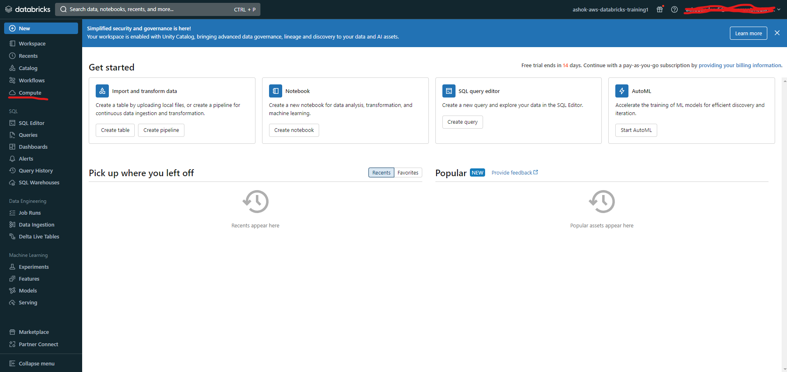
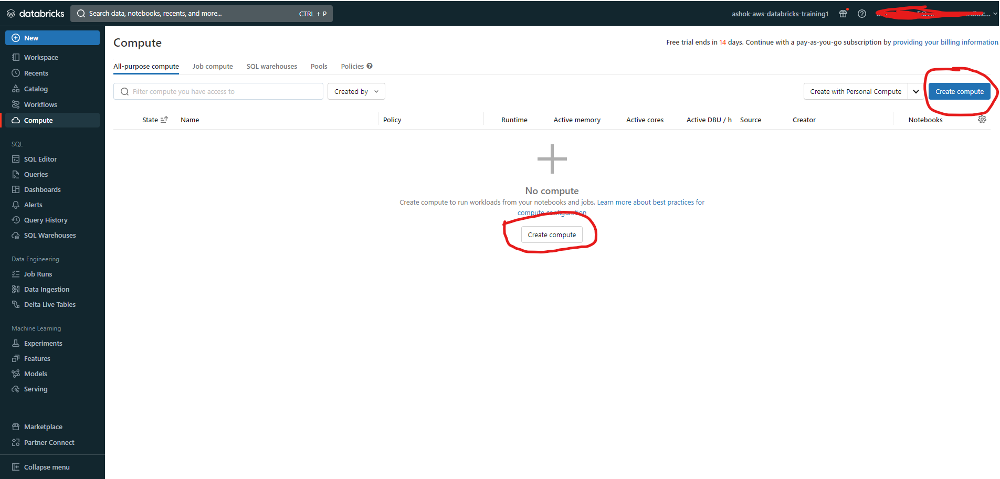
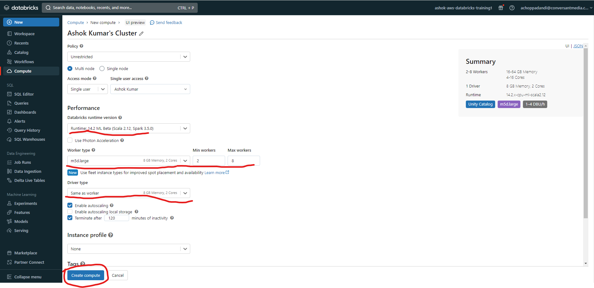
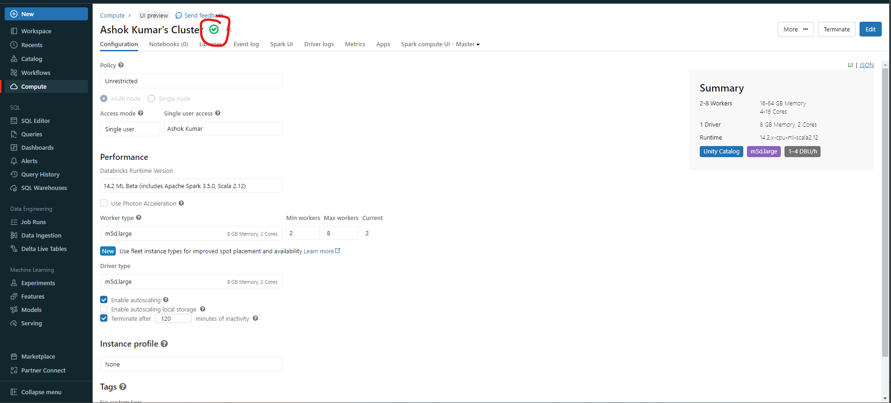

# Setting Databricks Compute Cluster Environment for Apache Spark

#### Login to Databricks Workspace

#### Click on Compute option in the left side menu from the workspace home page

#### Click on `Create Compute` button to create a new compute cluster

#### Configure Compute Cluster from the list of available options and click on `Create Compute`

The following options are available for configuring the compute cluster:

* Compute Cluster - (Ex: `Ashok Kumar's Cluster`)
* Policy - (Ex: `Unrestricted`)
* Access Mode - (Ex: `Single User`) & Single User Access - (Ex: `Ashok Kumar`)\

Under `Performance` section

* Databricks runtime version - (Ex: `Runtime: 14.2 ML Beta(Scala 2.12, Spark 3.5.0)`)
* Worker type - (Ex: `m5d.large`)
* Min workers - (Ex: `2`)
* Max workers - (Ex: `8`)
* Driver type - (Ex: `Same as worker`)
* Enable autoscaling - (Ex: `Yes`)
* Enable autoscaling local storage - (Ex: `No`)
* Terminate after minutes of activity - (Ex: `120`)

Note: Once all the configuration is setup and click on `Create Compute`, it will start spinning up Nodes for Master and Workers. Wait for the cluster to create and ready to use.

#### Compute cluster details

