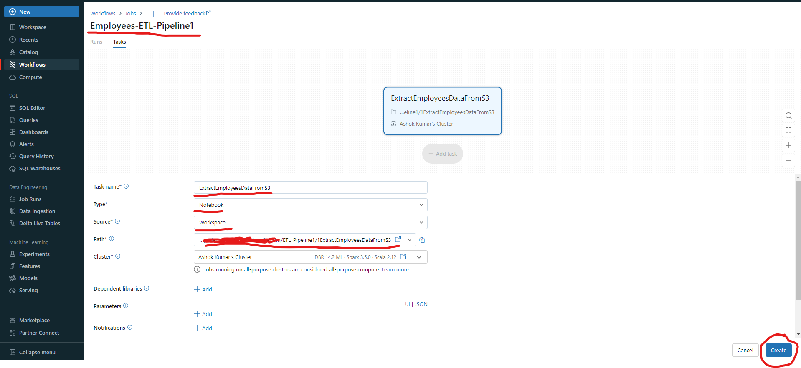

# Setting up Databricks Workflow for an ETL application

---

The following is the high-level flow of the ETL application / job used for demonstration:

* ***Extract*** - Reading employees data (csv files) from AWS S3 Bucket.
* ***Transform*** - Calculating the Dense Rank for every employee based on the salaries for each department
* ***Load*** - 
  * *Top 2 employees with the highest salaries for each department into a MySQL table*
  * *Total Employees Salaries for each department*
  * *Partition the employees data with dense rank on the departments*

The following are the sequence of steps to create the Databricks Workflow for an ETL application / job.

* Create Notebooks
* Installing MySQL Java Connector library on the Databricks Spark Cluster
* Create Job
* Add Tasks to Job to create the Workflow
* Execute the workflow

## Login to the Databricks Workspace

## Navigate to `Workspace` to create the Notebooks under the user home directory

## Create Notebooks

For demonstration, the following are the 5 Notebooks created for the ETL application:
1. To Read S3 Data using Spark from Databricks.
2. To generate Dense Rank for each employee based on their salary in each department
3. To write the Top 2 highest salaried employees to MySQL (Ex: `top2_employees`)
4. To write the Total salaries for each department to MySQL (Ex: `total_salaries_and_employees`)
5. To write partitioned data for each department to target AWS S3 Bucket location (Ex: `s3://ashok-s3-input-data/databricks-employees-output`)

The required 5 Notebooks are create in a directory with name `ETL-Pipeline1` as follows:

## Installing MySQL Java Connector

Goto the compute section and select the cluster then click on libraries and follow the steps as shown in the screenshots:

## Create Job

To create a job, goto the `Workflows` section

Click on `Create Job` button

Configure the job with the below parameters and then click on `Create`:

Workflow Name - (Ex: `Employees-ETL-Pipeline1`)
Task name - (Ex: `ExtractEmployeesDataFromS3`)
Type - (Ex: `Notebook`)
Path - <Path to the Notebook>
Cluster - <Cluster to execute the Notebook> If not running, it will start before executing the notebook.

## Add Tasks to Job to create the Workflow

The job /workflow looks like follows once it is created then click on `+ Add task` to add the tasks to the workflow.

Repeat adding the tasks to create the complete workflow as shown below:

## Execute the workflow

To execute the workflow, click on `Run now` button to start and the progress can be tracked under `Runs` tab.

