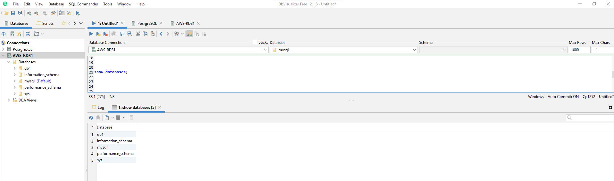

# Install and Setup MySQL database on Amazon Linux 2023


### Login to EC2 instance

```
ssh -i "AshokWindows.pem" ec2-user@ec2-54-80-211-173.compute-1.amazonaws.com
```


### Update OS Packages

```
sudo yum update -y
```


### List of RPM Packages for MySQL

To get the list of available MySQL RPM Packages - [click here](https://dev.mysql.com/downloads/repo/yum/)


### Download the required RPM Package for MySQL

```
wget https://dev.mysql.com/get/mysql80-community-release-el9-5.noarch.rpm

ls

pwd
```


### Install MySQL RPM Package

```
sudo dnf install mysql80-community-release-el9-5.noarch.rpm -y
```


### Update OS Packages to download MySQL Packages and search for the available versions 

```
sudo dnf update -y

sudo dnf search mysql-community-server
```


### Install MySQL Server Community Version

```
sudo dnf install mysql-community-server -y
```


### Start the MySQL service, status check and enable the service at boot time.

```
sudo systemctl status mysqld.service

sudo systemctl start mysqld.service

sudo systemctl status mysqld.service

sudo systemctl enable mysqld.service
```


Note: When the status of mysqld service is active, it means the MySQL server is up and running.

### Get the Temporary Password from MySQL Server log

Note: A Temporary password is auto-generated when the MySQL Server is started for the first time, and that is available in the log file `/var/log/mysqld.log`

```
sudo grep 'temporary password' /var/log/mysqld.log
```


### MySQL Secure Installation

MySQL secure installation is required for the following:

* To reset the `ROOT` password from random auto-generated password.
* To `Remove anonymous users`
* To `Disallow root login remotely`
* To `Remove test databases and access to it`
* To `Reload privilege tables now`

```
sudo mysql_secure_installation -p
```


### MySQL shell `ROOT` login

```
mysql -u root -p
```


### Create `ROOT` user and provide privileges for remote access

```
mysql> CREATE USER 'root'@'%' IDENTIFIED BY 'Password@123';

mysql> GRANT ALL PRIVILEGES ON *.* TO 'root'@'%' WITH GRANT OPTION;
```


### Connect to MySQL Server remotely from DBVisualizer (MySQL Client with UI)


### List of available databases

```
SHOW DATABASES;
```



### List tables in the database (example: db1)

```
SHOW TABLES IN db1
```


