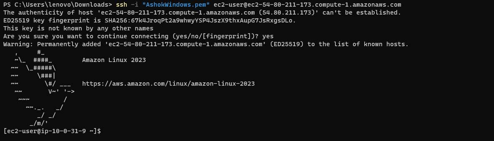
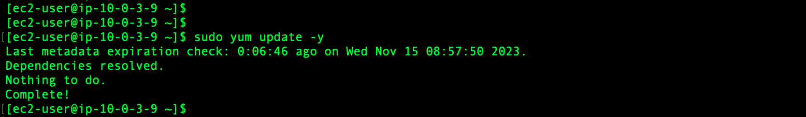
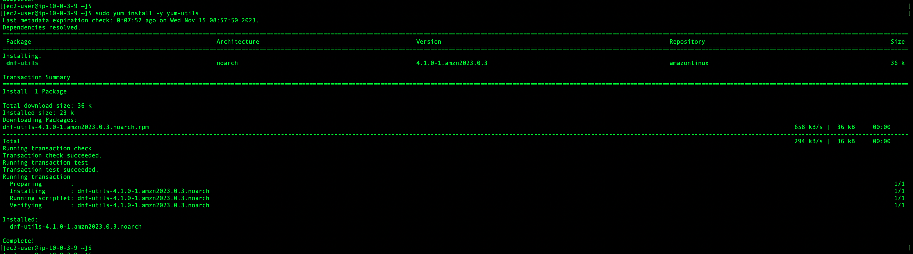
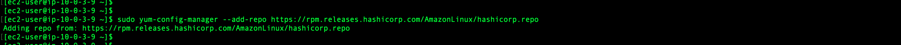
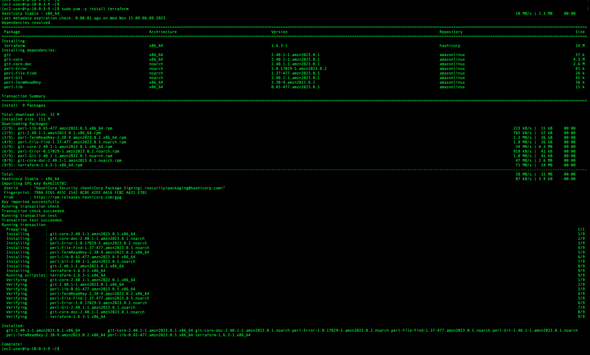

# Installing Terraform on Amazon EC2 - Amazon Linux 2023 

### Login to EC2 Instance

```
ssh -i "AshokAirflowInstance.pem" ec2-user@ec2-52-207-141-50.compute-1.amazonaws.com
```



### Update OS Packages

```
sudo yum update -y
```



### Install YUM Utils

```
sudo yum install -y yum-utils
```



### Add Terraform repo

```
sudo yum-config-manager --add-repo https://rpm.releases.hashicorp.com/AmazonLinux/hashicorp.repo
```



### Install Terraform

```
sudo yum -y install terraform
```

