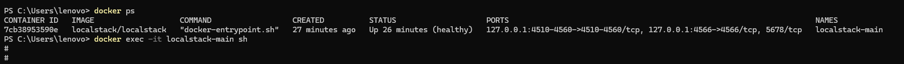
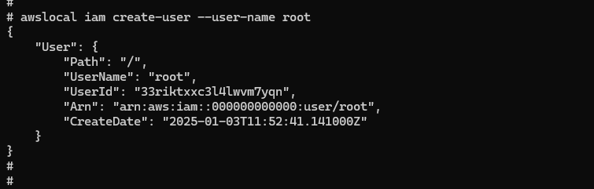
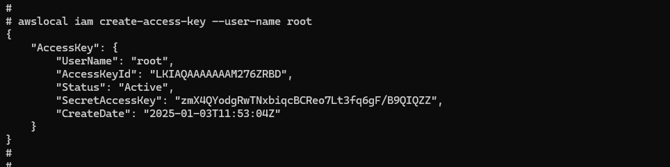
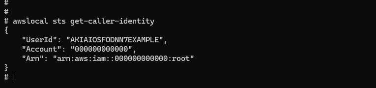
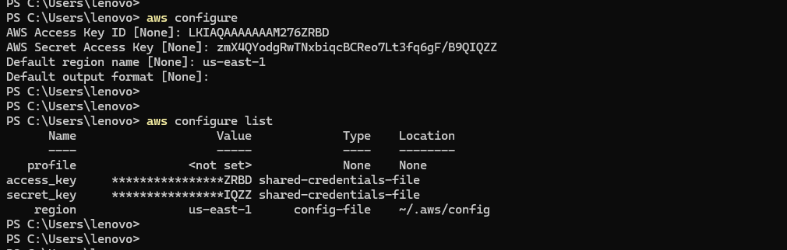
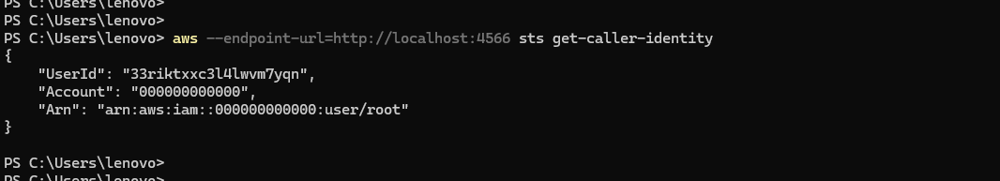

# Localstack Setup

## Windows

### Configuring AWS CLI - To work with Localstack

---
#### ROOT User creation

##### Login to Localstack docker container

```
docker ps
```

```
docker exec -it localstack-main sh
```



##### Create `ROOT` User

```
awslocal iam create-user --user-name root
```



##### Create *SECRET KEYS* for `ROOT` User

```
awslocal iam create-access-key --user root
```



##### ROOT User Caller Identity

```
awslocal sts get-caller-identity
```




#### Configuring AWS CLI in Windows

```
aws configure
```

```
aws configure list
```



NOTE: Copy AccessKeyId and SecretAccessKey from above steps

#### Using AWS CLI with Localstack

```
aws --endpoint-url=http://localhost:4566 sts get-caller-identity
```


