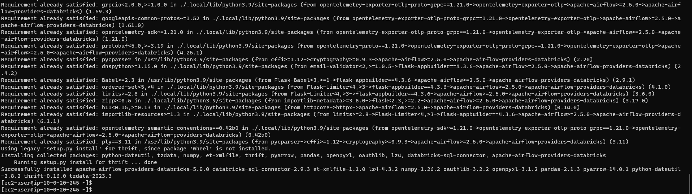
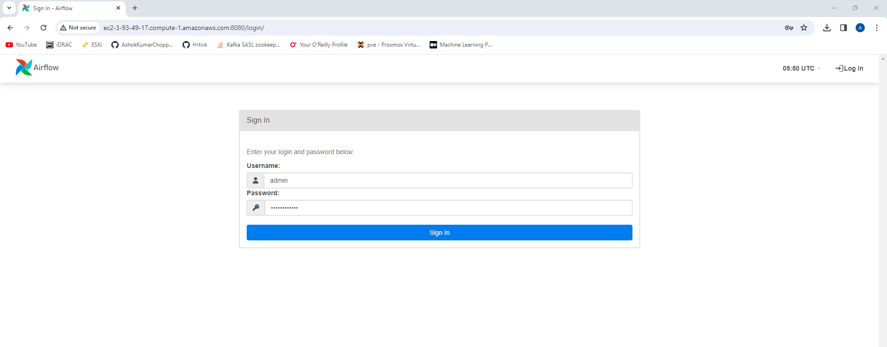
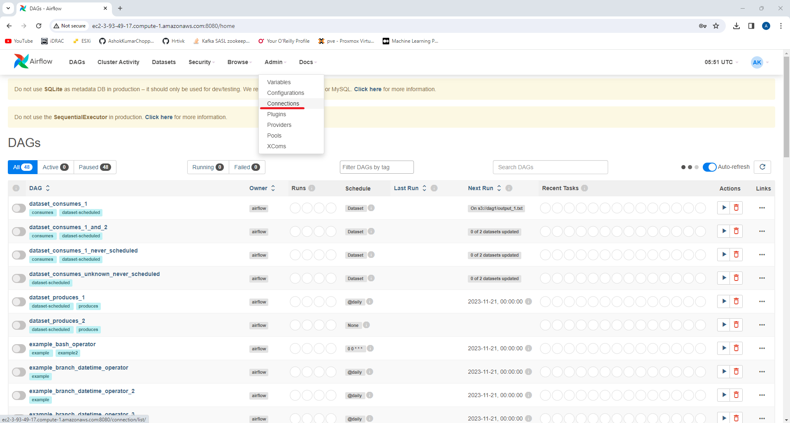

# Scheduling Databricks Workflows From Apache Airflow

#### Install Apache Airflow Provider Databricks library

```
pip install apache-airflow-providers-databricks
```




*Note: Restarting Apache Airflow Webserver is required.*

#### Login to Airflow Web UI

http://ec2-3-93-49-17.compute-1.amazonaws.com:8080



#### Databricks Workspace URL


#### Create Airflow Databricks Connection

Click on `Connections` option under `Admin` tab from the main menu.



To create a new connection, click on `+` button


Provide the required parameters for the new Databricks Connection. The following are the options provided:

* Connection Id - (Ex: `my-airflow-databricks-connection`)
* Connection Type - (Ex: `Databricks`)
* Host - (Ex: `https:\\dbc-fe789a27-xxxxxxxx.com`)
* Login - <UserName / UserEmail>
* Password - <User's Password>


Then click on `Save` button to add the new Databricks Connection and now the connection will be available in the list of connections


#### Get Databricks Workflow Details from the workspace


The workflow was triggered manually for one time, and it was successful


#### Write Python code to create a new Airflow DAG (`spark_databricks_job_dag.py`)

```
from airflow import DAG
from airflow.providers.databricks.operators.databricks import DatabricksRunNowOperator
from airflow.utils.dates import days_ago

default_args = {
    'owner': 'airflow'
}

with DAG('spark_databricks_dag',
        start_date = days_ago(2),
        schedule_interval = None.
        default_args = default_args
    ) as dag
    
    opr_run_now = DatabricksRunNowOperator(
        task_id = 'run_now',
        databricks_connection_id = 'my-airflow-databricks-connection',
        job_id = 331573125541721
    )
```


Add DAG to the Airflow DAGs folder i.e., `/home/ec2-users/airflow/dags/`


#### Wait & Refresh the Airflow Web UI

Refreshing the Airflow Web UI after waiting for some time, the newly added DAG will reflect in the list of DAGs


#### Enable and trigger the DAG to trigger the Databricks Workflow from Airflow


#### Workflow executes in Databricks


#### Airflow DAG success

Once all the tasks in the Databricks Workflow are successful, the Airflow DAG will be marked as successful.

