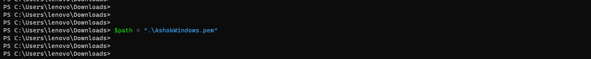
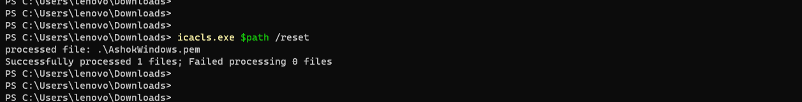
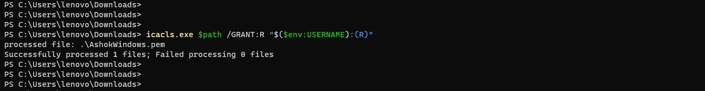
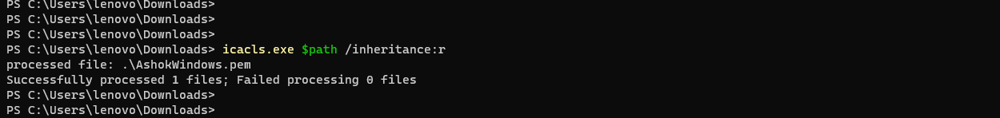

# Setting `400` permissions to .pem file in Windows 11

---

##### Note: Equivalent to chmod 400 in linux

```
chmod 0400 AshokWindows.pem
```

### Download .pem file from AWS and add it's location to path variable 

```
$path = ".\AshokWindows.pem"
```



### Reset all the permission using `icacls`

```
icacls.exe $path /reset
```



### Granting `READ` permission (`400`) using `icacls`

```
icacls.exe $path /GRANT:R "$($env:USERNAME):(R)"
```



### Inheriting permissions using `icacls`

```
icacls.exe $path /inheritance:r
```



### Logging into EC2 instance 

```
ssh -i "AshokWindows.pem" ec2-user@ec2-54-80-211-173.compute-1.amazonaws.com
```


